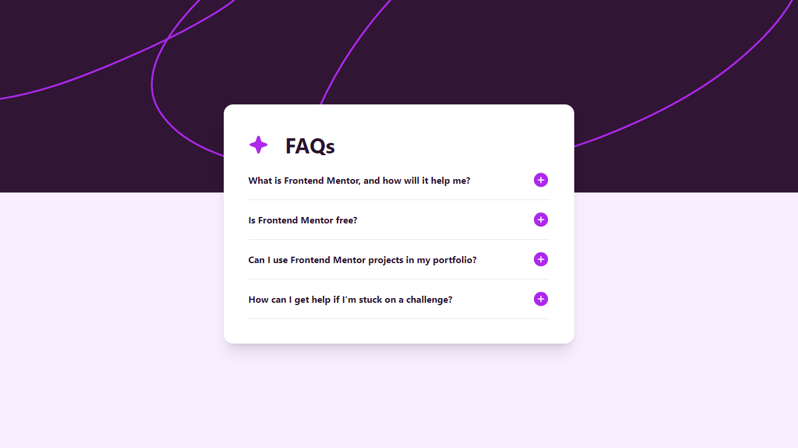

# Frontend Mentor - FAQ accordion solution

This is a solution to the [FAQ accordion challenge on Frontend Mentor](https://www.frontendmentor.io/challenges/faq-accordion-wyfFdeBwBz). Frontend Mentor challenges help you improve your coding skills by building realistic projects.

## Table of contents

- [Overview](#overview)
  - [The challenge](#the-challenge)
  - [Screenshot](#screenshot)
  - [Links](#links)
- [My process](#my-process)
  - [Built with](#built-with)
  - [What I learned](#what-i-learned)
  - [Continued development](#continued-development)
  - [Useful resources](#useful-resources)
- [Author](#author)
- [Acknowledgments](#acknowledgments)

## Overview

### The challenge

Users should be able to:

- Hide/Show the answer to a question when the question is clicked
- Navigate the questions and hide/show answers using keyboard navigation alone
- View the optimal layout for the interface depending on their device's screen size
- See hover and focus states for all interactive elements on the page

### Screenshot



### Links

- Solution URL: [Check out the repository here](https://github.com/JoshuaAsistio/faq-accordion)
- Live Site URL: [Live site URL here](https://faq-accordion-p6mg.onrender.com)

## My process

### Built with

- Semantic HTML5 markup
- Flexbox
- Mobile-first workflow
- [TailwindCSS](https://tailwindcss.com/) - For styles

### What I learned

During this project, I learned to use tailwindcss to create a functional accordion.

You can easily create an accordion with tailwindcss by using the hidden class and toggling it on and off with javascript:

```html
<p class="text-[#2c122f] hidden accordion-content">
  Frontend Mentor offers realistic coding challenges to help developers improve
  their frontend coding skills with projects in HTML, CSS, and JavaScript. It's
  suitable for all levels and ideal for portfolio building.
</p>
```

This is the js for toggling the hidden class:

```js
import questions from "./questions.js";

const buttons = document.getElementsByTagName("button");
const mainElement = document.querySelector("#main");

// dynamically adds questions based on the question.js file
for (let question of questions) {
  // create an element and give it the appropriate tailwind classes
  // set the inner html of the element to be the same in the index.html
  // Render the proper question and answer dynamically
  const element = document.createElement("div");
  element.classList.add("grid", "gap-8");
  element.innerHTML = `<button
  class="flex justify-between w-full items-center accordion-button hover:text-[#AD28EB]"
>
    <h2
      class="text-left w-[200px] font-bold text-[#2c122f] sm:w-full hover:text-[inherit]"
    >
      ${question.question}
    </h2>

    
  </button>

  <p class="text-[#2c122f] hidden accordion-content">
    ${question.answer}
  </p>
`;

  // append the div element together with an hr element to the main element
  mainElement.append(element, document.createElement("hr"));
}

// placed below here so that the answers are rendered to the page first before being fetched here
const contents = document.querySelectorAll(".accordion-content");

for (let button of buttons) {
  button.addEventListener("click", () => {
    const toggleIcon = button.lastElementChild; // plus / minos icon
    const content = button.nextElementSibling; // answers
    const isOpen = content.classList.toggle("hidden"); // true or false

    // makes sure that only one answer is open at a time
    contents.forEach((item, index) => {
      if (item !== content) {
        item.classList.add("hidden");
        document.querySelectorAll(".toggle-icon")[index].src =
          "images/icon-plus.svg";
      }
    });

    // hides and shows the answers when the same button is clicked consecutively.
    if (isOpen) {
      content.classList.add("hidden");
      toggleIcon.setAttribute("src", "images/icon-plus.svg");
      toggleIcon.setAttribute("alt", "plus icon");
    } else {
      content.classList.remove("hidden");
      toggleIcon.setAttribute("src", "images/icon-minus.svg");
      toggleIcon.setAttribute("alt", "minus icon");
    }
  });
}
```

## Author

- Website - [Joshua Asistio](https://joshuaasistio.github.io/portfolio/)
- Frontend Mentor - [@JoshuaAsistio](https://www.frontendmentor.io/profile/JoshuaAsistio)
- Github - [@JoshuaAsistio](https://github.com/JoshuaAsistio)
